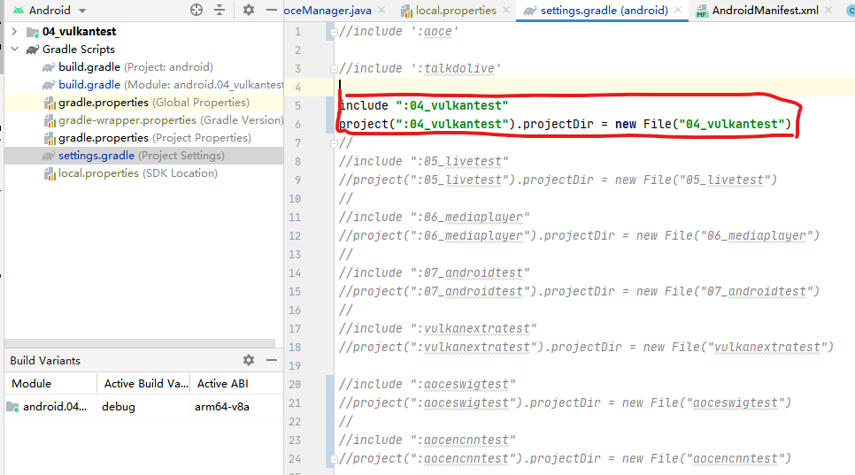
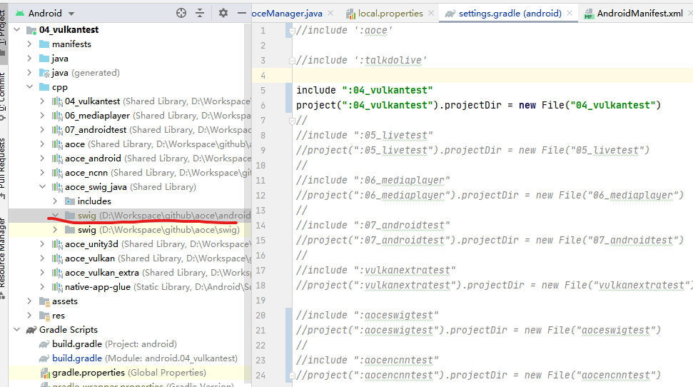
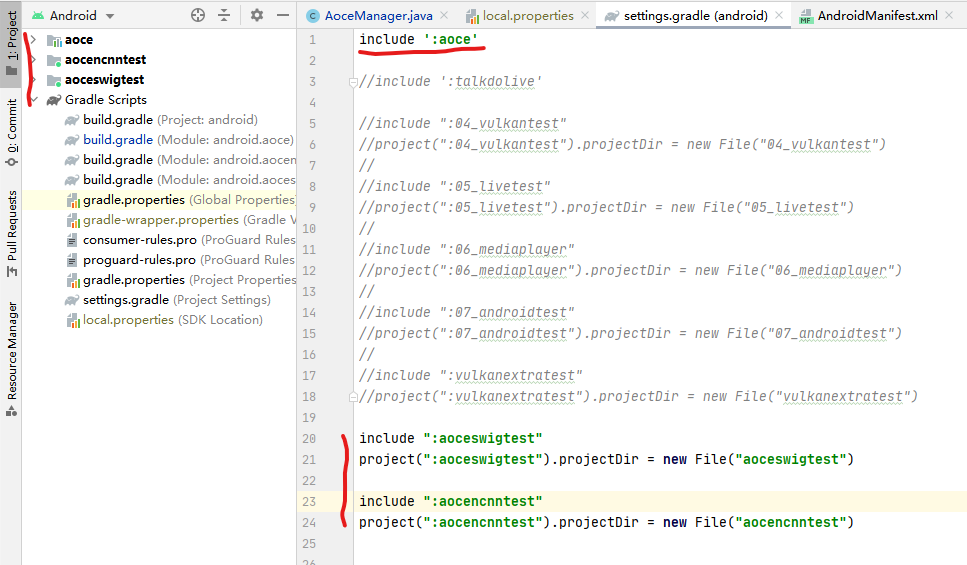

# Android

## 配置

查看路径 android/aoce/src/main/java/aoce/android/library是否有个文件夹xswig,这个文件夹放的是swig把C++接口转换生成的java代码.

如果没有,需要先使用swig生成,首先请在这个目录下,新建一个xswig文件夹,并让下面步骤操作.

1 安装[swig](http://www.swig.org/download.html),把带swig.exe的目录添加到环境变量Path中.

2 按照如下图把settings.gradle设置,只启用04_vulkantest,因为这个项目相对独立,只使用C++.

注意修改这个文件后,请点击Sync Now等待完成后继续操作.

3 连接真机,运行与调试都行,过程中编译C++成功后,就会在如下目录生成我们所需要的转换文件.

一般来说,这个目录会在(project/.cxx/cmake/{build type}/{abi}/swig/Java/swig)下,根据我的配置,就在(04_vulkantest/.cxx/cmake/debug/arm64-v8a/swig/Java/swig)下.

4 复制这个目录所有文件到android/aoce/src/main/java/aoce/android/library/xswig下.

5 转到我们java项目上来,还是针对settings.gradle设置.

等待Sync Now完成后,应该就是如上图显示,有了swig的生成文件,项目相应引用就不会有问题了.

aoce包含了swig转换的C++到java接口以及一些针对JNI操作和一些公共方法.

aoceswigtest就是GPUIMage里一百多种滤镜演示demo.

aocencnntest 是联合深度神经网络推理框架ncnn的一些demo测试.
