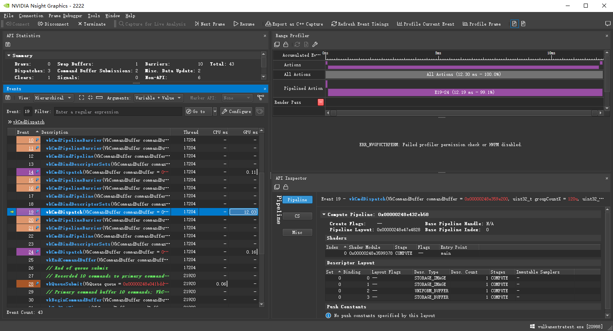
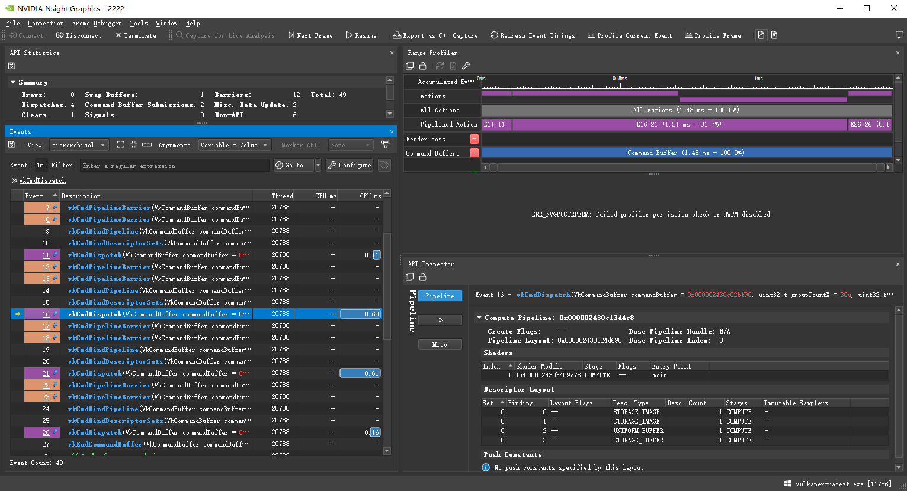

# 移植GPUImage的实现,用vulkan的compute shader完成各个功能

[iOS直播技术学习笔记-美颜滤镜效果（三）](https://www.jianshu.com/p/90f55e5b7d16)
[GPUImage 简介](https://gitee.com/xudoubi/GPUImage)

## opengl/cuda computer shader 线程

gl_NumWorkGroups/gridDim: 所有线程块的多少.
gl_WorkGroupSize/blockDim: 本身线程块的大小.
gl_WorkGroupID/blockIdx: 线程块在所有线程块中索引.
gl_LocalInvocationID/threadIdx: 线程在线程块中的索引.
gl_GlobalInvocationID = blockIdx*blockDim + gl_LocalInvocationID

## 功能介绍

### ChromKey

[UE4 Matting](https://www.unrealengine.com/en-US/tech-blog/setting-up-a-chroma-key-material-in-ue4)

主要注意一点,UBO,我特意把一个float,vec3放一起,想当然的认为是按照vec4排列,这里注意,vec3不管前后接什么,按照vec4排的.

### Luminance 取亮度

各种标准，其中人眼对绿色比较敏感，绿色占比最高，红色次之。

### BoxBlur 均值模糊

[图像处理中的卷积核分离](https://zhuanlan.zhihu.com/p/81683945)

可以从上图推导过程中看出，一个m行乘以n列的高斯卷积可以分解成一个1行乘以n列的行卷积，之后串联一个m行乘以1列的列卷积的形式，输出保持不变。行卷积的卷积核参数（均值和方差）等于原始m行n列卷积核在列方向（Y方向）的均值和方差，列卷积的卷积核参数等于原始m行n列卷积核在行方向（X方向）上的均值和方差。

opencv cudafilters的高斯卷积,就采用先计算水平卷积,然后计算垂直卷积的优化方式.

其中边框模式暂时先固定为REPLICATE.

[调整图像边缘](https://blog.csdn.net/shuiyixin/article/details/106472722)

### GaussianBlur

[Markdown 数学公式语法](https://www.jianshu.com/p/4460692eece4)

[Cmd Markdown 公式指导手册](https://www.zybuluo.com/codeep/note/163962)

[OpenCV高斯滤波GaussianBlur](https://blog.csdn.net/godadream/article/details/81568844)

在android 1080P下20*20的核，Radmi K10 Pro不到一桢.

优化方向

1 卷积核分离，一个m行乘以n列的高斯卷积可以分解成一个1行乘以n列的行卷积，常用的BOX与高斯都可以分解。

2 利用shared局部显存减少访问纹理显存的操作,注意这块容量非常有限,如果不合理分配，能并行的组就少了.考虑到Android平台，使用packUnorm4x8/unpackUnorm4x8优化局部显存占用。

主要使用opencv里opencv_cudafilters模块代码。

|  |row kenrel| |
| ------ | ------ | ------ |
| WorkGroupSize*HALO_SIZE | WorkGroupSize*PATCH_PER_BLOCK | WorkGroupSize*HALO_SIZE |

| column kenrel |
| --- |
|WorkGroupSize*HALO_SIZE|
|WorkGroupSize*PATCH_PER_BLOCK|
|WorkGroupSize*HALO_SIZE|

其中正常PATCH_PER_BLOCK是一个线程操作几个像素，一般常用图像处理操作来说，我们都是1：1，在这设置4。
针对图像块就是WorkGroupSize*PATCH_PER_BLOCK这块正常取对应数据，其中HALO_SIZE块在row中是左右二边，如果是最左边和最右边需要考虑取不到的情况，我采用的逻辑对应opencv的边框填充REPLICATE模式，余下的块的HALO_SIZE块都不是对应当前线程组对应的图像块。column的上下块同理，可以看到最大核的大小限定在HALO_SIZEx2+WorkGroupSize.

其中在PC平台应用如上优化会有噪点，特别是核小的时候。

我分别针对filterRow/filterColumn做测试应用，发现只有filterColumn有问题，而代码我反复检测也没发现那有逻辑错误，更新逻辑查看filterColumn我在groupMemoryBarrier后，隔gl_WorkGroupSize.y的数据能拿到，但是行+1拿的是有噪点的，断定问题出在同步局部共享显存上，groupMemoryBarrier改为memoryBarrier还是不行，后改为barrier可行，按逻辑上来说，应该是用groupMemoryBarrier就行，不知是不是和硬件有关。

在1080P下取核半径为10的高斯模糊查看没有优化/优化的效果。

其中没优化的需要12.03ms,而优化后的是0.60+0.61=1.21ms,差不多10倍左右的差距.

### AdaptiveThreshold 自适应阈值化操作

[自适应阈值化操作](https://www.cnblogs.com/GaloisY/p/11037350.html)

效果图:

### HarrisCornerDetection

[How to detect corners in a binary images with OpenGL?](https://dsp.stackexchange.com/questions/401/how-to-detect-corners-in-a-binary-images-with-opengl)

[Harris 角点检测](https://blog.csdn.net/u014485485/article/details/79056666)
