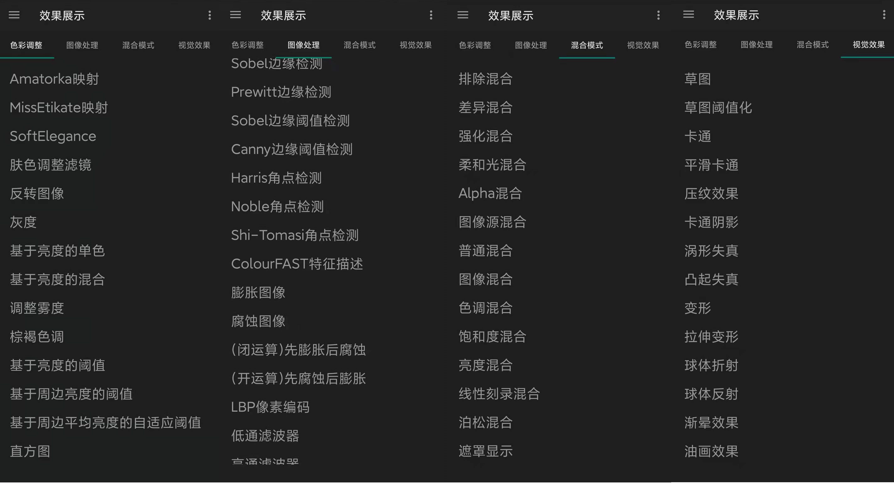

# Vulkan移植GPUImage的安卓Demo展示

[演示Android apk下载](https://github.com/xxxzhou/aoce_thirdparty/blob/main/aoceswigtest-release.apk) 需要Android 8以上.

先看效果图,大约一百多种滤镜,有超过一半的滤镜有参数设置,其参数调整界面使用反射自动生成与绑定.

如下每种选择一些进行展示.

## 色彩调整

## 图像处理

## 混合模式

## 视觉效果

如果对实现过程感兴趣,请转到[Vulkan移植GPUImage总结](Vulkan移植GPUImage总结.md),从aoce/Vulkan底层框架实现,到vulkan如何用ComputeShader实现GPUImage的滤镜实现,与游戏引擎UE4/Unity3d中dx11/openges纹理对接,如何使用CMake+Swig自动封装C++成C#/Java的所有流程实现.

其中java调用C++接口用Swig自动完成的,如果你没有安装Swig,编译时生成不了转接文件,这些自动生成的文件不能放入版本管理,因此我把其中C++/java转接的aoce模块导出成[aoce-release.aar](https://github.com/xxxzhou/aoce_thirdparty/blob/main/aoce-release.aar),如果你没有装Swig那就移除aoce模块,使用这个aar导入aoceswigtest模块中.

[项目github地址](https://github.com/xxxzhou/aoce) 针对window/andorid的多媒体与图像处理,有兴趣的点个Star.
