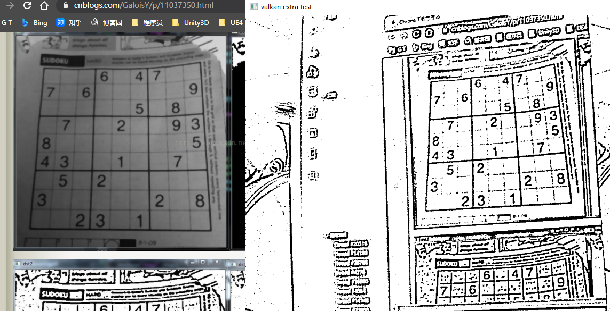

# Vulkan移植GpuImage(一)高斯模糊与自适应阈值

## 自适应阈值效果图 [demo](https://github.com/xxxzhou/aoce/tree/master/samples/vulkanextratest)



这几天抽空看了下GpuImage的filter,移植了高斯模糊与自适应阈值的vulkan compute shader实现,一个是基本的图像处理,一个是组合基础图像处理聚合,算是比较有代表性的二种.

## [高斯模糊实现与优化](https://github.com/xxxzhou/aoce/tree/master/code/aoce_vulkan_extra)

大部分模糊效果主要是卷积核的实现,相应值根据公式得到.

```c++
int ksize = paramet.blurRadius * 2 + 1;
if (paramet.sigma <= 0) {
    paramet.sigma = ((ksize - 1) * 0.5 - 1) * 0.3 + 0.8;
}
double scale = 1.0f / (paramet.sigma * paramet.sigma * 2.0);
double cons = scale / M_PI;
double sum = 0.0;
std::vector<float> karray(ksize * ksize);
for (int i = 0; i < ksize; i++) {
    for (int j = 0; j < ksize; j++) {
        int x = i - (ksize - 1) / 2;
        int y = j - (ksize - 1) / 2;
        karray[i * ksize + j] = cons * exp(-scale * (x * x + y * y));
        sum += karray[i * ksize + j];
    }
}
sum = 1.0 / sum;
for (int i = ksize * ksize - 1; i >= 0; i--) {
    karray[i] *= sum;
}
```

其中对应compute shader代码.

```glsl
#version 450

layout (local_size_x = 16, local_size_y = 16) in;// gl_WorkGroupSize
layout (binding = 0, rgba8) uniform readonly image2D inTex;
layout (binding = 1, rgba8) uniform image2D outTex;
layout (binding = 2) uniform UBO 
{
    int xksize;	
    int yksize;	
    int xanchor;
    int yanchor;
} ubo;

layout (binding = 3) buffer inBuffer{
    float kernel[];
};

void main(){
    ivec2 uv = ivec2(gl_GlobalInvocationID.xy);
    ivec2 size = imageSize(outTex);    
    if(uv.x >= size.x || uv.y >= size.y){
        return;
    }
    vec4 sum = vec4(0);
    int kInd = 0;
    for(int i = 0; i< ubo.yksize; ++i){
        for(int j= 0; j< ubo.xksize; ++j){
            int x = uv.x-ubo.xanchor+j;
            int y = uv.y-ubo.yanchor+i;
            // REPLICATE border
            x = max(0,min(x,size.x-1));
            y = max(0,min(y,size.y-1));
            vec4 rgba = imageLoad(inTex,ivec2(x,y)) * kernel[kInd++];
            sum = sum + rgba;
        }
    }
    imageStore(outTex, uv, sum); 
}
```

这样一个简单的高斯模糊就实现了,结果就是我在用Radmi K10 Pro在摄像头1080P下使用21的核长是不到一桢的处理速度.

高斯模糊的优化都有现成的讲解与实现,其一就是[图像处理中的卷积核分离](https://zhuanlan.zhihu.com/p/81683945),一个m行乘以n列的高斯卷积可以分解成一个1行乘以n列的行卷积,计算复杂度从原来的O(k^2)降为O(k),其二就是用shared局部显存减少访问纹理显存的操作,注意这块容量非常有限,如果不合理分配,能并行的组就少了.考虑到Android平台,使用packUnorm4x8/unpackUnorm4x8优化局部显存占用.

其核分成一列与一行,具体相应实现请看VkSeparableLinearLayer类的实现,由二个compute shader组合执行.

```c++
int ksize = paramet.blurRadius * 2 + 1;
std::vector<float> karray(ksize);
double sum = 0.0;
double scale = 1.0f / (paramet.sigma * paramet.sigma * 2.0);
for (int i = 0; i < ksize; i++) {
    int x = i - (ksize - 1) / 2;
    karray[i] = exp(-scale * (x * x));
    sum += karray[i];
}
sum = 1.0 / sum;
for (int i = 0; i < ksize; i++) {
    karray[i] *= sum;
}
rowLayer->updateBuffer(karray);
updateBuffer(karray);
```

其glsl主要逻辑实现来自opencv里opencv_cudafilters模块里cuda代码改写,在这只贴filterRow的实现,filterColumn的实现和filterRow类似,有兴趣的朋友可以自己翻看.

```glsl
#version 450

layout (local_size_x = 16, local_size_y = 16) in;// gl_WorkGroupSize
layout (binding = 0, rgba8) uniform readonly image2D inTex;
layout (binding = 1, rgba8) uniform image2D outTex;
layout (binding = 2) uniform UBO 
{
	int xksize;	
    int anchor;
} ubo;

layout (binding = 3) buffer inBuffer{
    float kernel[];
};

const int PATCH_PER_BLOCK = 4;
const int HALO_SIZE = 1;
// 共享块,扩充左边右边HALO_SIZE(分为左边HALO_SIZE,中间自身*PATCH_PER_BLOCK,右边HALO_SIZE)
shared uint row_shared[16][16*(PATCH_PER_BLOCK+HALO_SIZE*2)];//vec4[local_size_y][local_size_x]

// 假定1920*1080,gl_WorkGroupSize(16,16),gl_NumWorkGroups(120/4,68),每一个线程宽度要管理4个
// 核心的最大宽度由HALO_SIZE*gl_WorkGroupSize.x决定
void main(){    
    ivec2 size = imageSize(outTex);  
    uint y = gl_GlobalInvocationID.y;
    if(y >= size.y){
        return;
    }
    // 纹理正常范围的全局起点
    uint xStart = gl_WorkGroupID.x * (gl_WorkGroupSize.x*PATCH_PER_BLOCK) + gl_LocalInvocationID.x;
    // 每个线程组填充HALO_SIZE*gl_WorkGroupSize个数据
    // 填充每个左边HALO_SIZE,需要注意每行左边是没有纹理数据的
    if(gl_WorkGroupID.x > 0){//填充非最左边块的左边
        for(int j=0;j<HALO_SIZE;++j){
            vec4 rgba = imageLoad(inTex,ivec2(xStart-(HALO_SIZE-j)*gl_WorkGroupSize.x,y));
            row_shared[gl_LocalInvocationID.y][gl_LocalInvocationID.x + j*gl_WorkGroupSize.x] = packUnorm4x8(rgba);
        } 
    }else{ // 每行最左边
        for(int j=0;j<HALO_SIZE;++j){      
            uint maxIdx = max(0,xStart-(HALO_SIZE-j)*gl_WorkGroupSize.x);
            vec4 rgba = imageLoad(inTex,ivec2(maxIdx,y));      
            row_shared[gl_LocalInvocationID.y][gl_LocalInvocationID.x + j*gl_WorkGroupSize.x] = packUnorm4x8(rgba);
        }
    }
    // 填充中间与右边HALO_SIZE块,注意每行右边的HALO_SIZE块是没有纹理数据的
    if(gl_WorkGroupID.x + 2 < gl_NumWorkGroups.x){
        // 填充中间块
        for(int j=0;j<PATCH_PER_BLOCK;++j){
            vec4 rgba = imageLoad(inTex,ivec2(xStart+j*gl_WorkGroupSize.x,y));
            uint x = gl_LocalInvocationID.x + (HALO_SIZE+j)*gl_WorkGroupSize.x;
            row_shared[gl_LocalInvocationID.y][x] = packUnorm4x8(rgba);
        }
        // 右边的扩展中,还在纹理中
        for(int j=0;j<HALO_SIZE;++j){
            vec4 rgba = imageLoad(inTex,ivec2(xStart+(PATCH_PER_BLOCK+j)*gl_WorkGroupSize.x,y));
            uint x = gl_LocalInvocationID.x + (PATCH_PER_BLOCK+HALO_SIZE+j)*gl_WorkGroupSize.x;
            row_shared[gl_LocalInvocationID.y][x] = packUnorm4x8(rgba);
        }
    }else{// 每行右边的一个块
        for (int j = 0; j < PATCH_PER_BLOCK; ++j){
            uint minIdx = min(size.x-1,xStart+j*gl_WorkGroupSize.x);
            uint x = gl_LocalInvocationID.x + (HALO_SIZE+j)*gl_WorkGroupSize.x;
            row_shared[gl_LocalInvocationID.y][x] = packUnorm4x8(imageLoad(inTex,ivec2(minIdx,y)));
        }
        for(int j=0;j<HALO_SIZE;++j){
            uint minIdx = min(size.x-1,xStart+(PATCH_PER_BLOCK+j)*gl_WorkGroupSize.x);
            uint x = gl_LocalInvocationID.x + (PATCH_PER_BLOCK+HALO_SIZE+j)*gl_WorkGroupSize.x;
            row_shared[gl_LocalInvocationID.y][x] = packUnorm4x8(imageLoad(inTex,ivec2(minIdx,y)));
        }
    }
    // groupMemoryBarrier();
    memoryBarrier();
    for (int j = 0; j < PATCH_PER_BLOCK; ++j){
        uint x = xStart + j*gl_WorkGroupSize.x;
        if(x<size.x){
            vec4 sum = vec4(0);
            for(int k=0;k<ubo.xksize;++k){
                uint xx = gl_LocalInvocationID.x + (HALO_SIZE+j)*gl_WorkGroupSize.x - ubo.anchor + k;
                sum = sum+unpackUnorm4x8(row_shared[gl_LocalInvocationID.y][xx]) * kernel[k];
            }              
            imageStore(outTex, ivec2(x,y),sum); 
        }
    }
}
```

一般compute shader常用图像处理操作来说,我们一个线程处理一个像素,在这里PATCH_PER_BLOCK=4,表示一个线程操作4个像素,所以线程组的分配也会改变,针对图像块就是WorkGroupSize*PATCH_PER_BLOCK这块正常取对应数据,其中HALO_SIZE块在row中是左右二边,如果是最左边和最右边需要考虑取不到的情况,我采用的逻辑对应opencv的边框填充REPLICATE模式,余下的块的HALO_SIZE块都不是对应当前线程组对应的图像块.column的上下块同理,可以看到最大核的大小限定在HALO_SIZEx2+WorkGroupSize,如果填有超大核的要求,可以变大HALO_SIZE.

不过优化完后,我发现在PC平台应用会有噪点,特别是核小的时候.我分别针对filterRow/filterColumn做测试应用,发现只有filterColumn有问题,而代码我反复检测也没发现那有逻辑错误,更新逻辑查看filterColumn各种测试中,我发现在groupMemoryBarrier后,隔gl_WorkGroupSize.y的数据能拿到,但是行+1拿的是有噪点的,断定问题出在同步局部共享显存上,前面核大不会出现这问题也应该是核大导致局部共享显存变大导致并行线程组数少,groupMemoryBarrier改为memoryBarrier还是不行,后改为barrier可行,按逻辑上来说,应该是用groupMemoryBarrier就行,不知是不是和硬件有关,不为奇怪的是为啥filterRow的使用groupMemoryBarrier没问题了,二者唯一区别一个是扩展宽度,一个扩展长度,有思路的朋友欢迎解答.

在1080P下取核长为21(半径为10)的高斯模糊查看PC平台没有优化及优化的效果.


其中没优化的需要12.03ms,而优化后的是0.60+0.61=1.21ms,差不多10倍左右的差距,符合前面k/2的优化值,之所以快到理论值,应该要加上优化方向二使用局部共享显存减少访问纹理显存这个.

把更新后的实现再次放入Radmi K10 Pro,同样1080P下21核长下,可以看到不是放幻灯片了,差不多有10桢了吧,没有专业工具测试,后续有时间完善测试比对.

## AdaptiveThreshold [自适应阈值化](https://github.com/xxxzhou/aoce/blob/master/code/aoce_vulkan_extra/layer/VkAdaptiveThresholdLayer.cpp)

可以先看下GPUImage3里的实现.

```swift
public class AdaptiveThreshold: OperationGroup {
    public var blurRadiusInPixels: Float { didSet { boxBlur.blurRadiusInPixels = blurRadiusInPixels } }
    
    let luminance = Luminance()
    let boxBlur = BoxBlur()
    let adaptiveThreshold = BasicOperation(fragmentFunctionName:"adaptiveThresholdFragment", numberOfInputs:2)
    
    public override init() {
        blurRadiusInPixels = 4.0
        super.init()
        
        self.configureGroup{input, output in
            input --> self.luminance --> self.boxBlur --> self.adaptiveThreshold --> output
                      self.luminance --> self.adaptiveThreshold
        }
    }
}
```

可以看到实现不复杂,根据输入图片得到亮度,然后boxBlur,然后把亮度图与blur后的亮度图交给adaptiveThreshold处理就完成了,原理很简单,但是要求层可以内部加入别的处理层以及多输入,当初设计时使用Graph计算图时就考虑过多输入多输出的问题,这个是支持的,内部层加入别的处理层,这是图层组合能力,这个我当初设计是给外部使用者用的,在这稍微改动一下,也是比较容易支持内部层类组合.

```c++
void VkAdaptiveThresholdLayer::onInitGraph() {
    VkLayer::onInitGraph();
    // 输入输出
    inFormats[0].imageType = ImageType::r8;
    inFormats[1].imageType = ImageType::r8;
    outFormats[0].imageType = ImageType::r8;
    // 这几个节点添加在本节点之前
    pipeGraph->addNode(luminance.get())->addNode(boxBlur->getLayer());
    // 更新下默认UBO信息
    memcpy(constBufCpu.data(), &paramet.offset, conBufSize);
}

void VkAdaptiveThresholdLayer::onInitNode() {
    luminance->getNode()->addLine(getNode(), 0, 0);
    boxBlur->getNode()->addLine(getNode(), 0, 1);
    getNode()->setStartNode(luminance->getNode());
}
```

和别的处理层一样,不同的是添加这个层时,根据onInitNode设定Graph如何自动连接前后层.

相应的luminance/adaptiveThreshold以及专门显示只有一个通道层的图像处理大家有兴趣自己翻看,比较简单就不贴了.

有兴趣的可以在[samples/vulkanextratest](https://github.com/xxxzhou/aoce/blob/master/samples/vulkanextratest)里,PC平台修改Win32.cpp,Android平台修改Android.cpp查看不同效果.后续有时间完善android下的UI使之查看不同层效果.
